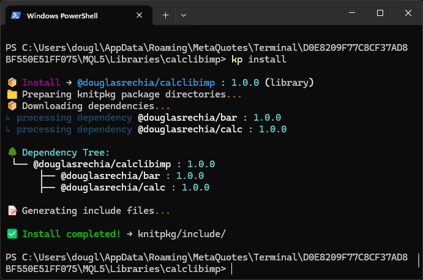

# Include mode vs Flat mode

KnitPkg supports two strategies for making dependency headers available to your project at compile time:

- **Include mode**: `include_mode: include`
- **Flat mode**: `include_mode: flat`

---

## Include mode (`include_mode: include`)

In **include mode**, KnitPkg does **not** generate a flat (single-file) header.

Instead, when you run `kp install`, KnitPkg:

1. Resolves your dependency versions using the registry metadata.
2. Downloads dependency sources into `.knitpkg/cache`.
3. Processes the dependency headers and resolves any `@knitpkg:include` directives found inside them.
4. “Mounts” (builds) a merged include tree under `knitpkg/include/`.

The key idea is: after `kp install`, `knitpkg/include/` contains the headers your project needs, organized by organization and package name, ready to be referenced by `#include`.

---

## Flat mode (`include_mode: flat`)

In **flat mode**, `kp install` generates a **single flattened header** (a “flat file”) from a declared entrypoint.

Conceptually, KnitPkg:

1. Resolves and downloads dependencies into `.knitpkg/cache`.
2. Reads the entrypoint header(s) declared in the manifest.
3. Follows `@knitpkg:include` directives to pull external headers from dependencies.
4. Produces a generated file under `knitpkg/flat/` (for example `knitpkg/flat/KnitPkgSMA_flat.mqh`), containing everything needed to compile.

The key idea is: instead of including many separate headers, your main `.mq5` includes **one generated file**.

---

## A concrete example: `calclibimp` uses include mode

To make this less abstract, let’s look at the project [`calclibimp`](https://forge.mql5.io/DouglasRechia/calclibimp/src/commit/352f3fddada91103d1fc0f266a988c49e0046de7). In short, `calclibimp` is an MQL5 **library** project meant to expose indicator calculations from `@douglasrechia/calc` as a compiled library.

!!! info
    The package `@douglasrechia/calclib` provides stubs to make it easy for any KnitPkg project to link against `@douglasrechia/calclibimp`.

Below is the `knitpkg.yaml` from `calclibimp`. Note the highlighted lines: it is a **library**, it uses **include mode**, and it depends on `bar` and `calc`.

```yaml title="knitpkg.yaml" linenums="1" hl_lines="2 15 21-23"
target: mql5
type: library

organization: douglasrechia
name: calclibimp
version: 1.0.0

# Fields to search for package metadata
description: Simple library implementation to expose indicators calculations from @douglasrechia/calc
keywords: ["sma", "library", "indicator"]
author: Douglas Rechia
license: MIT

# Include mode resolution
include_mode: include

compile:
  - src/CalcLibImp.mq5

# Dependencies of the project
dependencies:
  bar: ^1.0.0
  calc: ^1.0.0
```

### What happens when you run `kp install`?

In include mode, after `kp install` finishes, you will typically see a directory structure like this:



```text title="knitpkg/ tree after install"
knitpkg/
└───include/
    └───douglasrechia/
        ├───bar/
        │       Bar.mqh
        │       BarArray.mqh
        │       BarMqlRates.mqh
        │       BarTimeSeries.mqh
        │       BarWatcher.mqh
        │       TimeSeries.mqh
        │       TimeSeriesArray.mqh
        │
        └───calc/
                Calc.mqh
```

Notice how `knitpkg/include/` now contains the headers for the `bar` and `calc` dependencies. This is the core promise of include mode: KnitPkg installs the dependency headers into a predictable include tree so your project can compile.

### No entrypoint required

In **include mode**, you do **not** need an `entrypoints:` section in the manifest.

Your main source file can include dependency headers directly from `knitpkg/include/`. For example, in [`src/CalcLibImp.mq5`](https://forge.mql5.io/DouglasRechia/calclibimp/src/commit/352f3fddada91103d1fc0f266a988c49e0046de7/src/CalcLibImp.mq5), the includes look like:

```mql5 linenums="1"
#include "../knitpkg/include/douglasrechia/calc/Calc.mqh"
#include "../knitpkg/include/douglasrechia/bar/TimeSeriesArray.mqh"
```

---

## How to choose between include mode and flat mode

The choice depends on how you want to ship and organize your project:

- **Choose flat mode** when you want to distribute a project as a small set of files (often a single generated include), such as projects published/sold to end-users (for example in the MQL5 store). Flat mode can reduce the number of extra files installed in a user’s environment, at the cost of a bit more setup (entrypoint + generation step).
- **Choose include mode** when you prefer a classic include-tree workflow (many headers available under `knitpkg/include/`), and you don’t mind the dependency headers being materialized as separate files.

In both modes, the workflow is still the same at a high level: `kp install` resolves and downloads dependencies, then prepares your project so `kp compile` can run successfully.