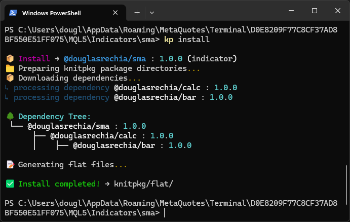

## The install process

When you run `kp install`, KnitPkg performs (conceptually) the following steps:

1. Reads registry metadata to resolve dependency versions.
2. Downloads dependency sources (for example, the `calc` project) into `.knitpkg/cache`.
3. Processes the entrypoint and detects `@knitpkg:include` directives, which reference external headers coming from dependencies.
4. Generates the file `knitpkg/flat/KnitPkgSMA_flat.mqh`.

See below how the terminal looks like after you run `kp install`:



Inside `knitpkg/flat/KnitPkgSMA_flat.mqh` we have the class TimeSeriesArray and the SMA function used by the indicator:

```mql5  linenums="188" title="douglasrechia::TimeSeriesArray class in KnitPkgSMA_flat.mqh"
//+------------------------------------------------------------------+
//| SeriesArray — wraps arrays as ISeries<T>
//+------------------------------------------------------------------+
namespace douglasrechia
{

template<typename T>
class TimeSeriesArray : public ITimeSeries<T>
  {
private:
   T                 m_array[];
```

```mql5  linenums="135" title="douglasrechia::SMA function in KnitPkgSMA_flat.mqh"
//+------------------------------------------------------------------+
namespace douglasrechia
{
//+------------------------------------------------------------------+
//| Simple Moving Average                                            |
//+------------------------------------------------------------------+
double SMA(douglasrechia::ITimeSeries<double> &series, int period, int shift = 0)
  {
   if(series.Size() < (period + shift))
      return 0.0;

   double sum = 0.0;
   for(int i = shift; i < shift + period; i++)
      sum += series.ValueAtShift(i);

   return sum / period;
  }
```


As we can see, that generated file is a “flattened” (`flat`) header that contains all the dependency code the indicator needs. After it exists, the main file `src/KnitPkgSMA.mq5` can include it and compilation works normally. What if we try `kp compile`?


Voilá—thanks to KnitPkg, the project compiles all the sources declared in the manifest `compile` entry and the indicator is ready to use!

