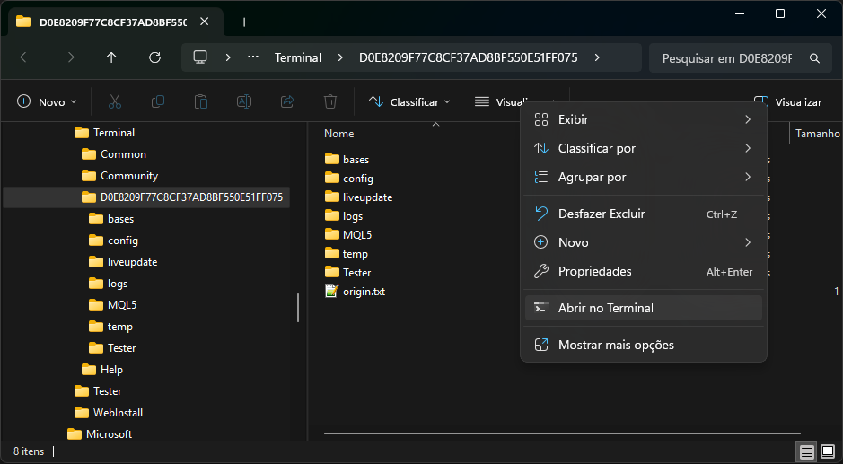
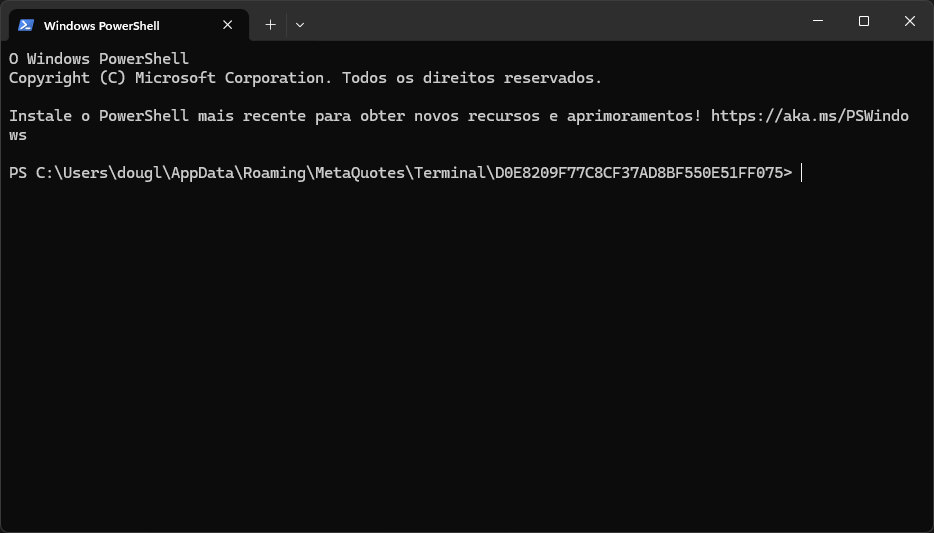
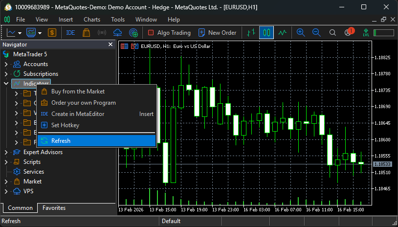
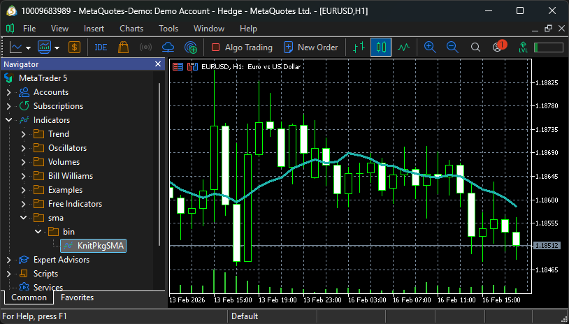
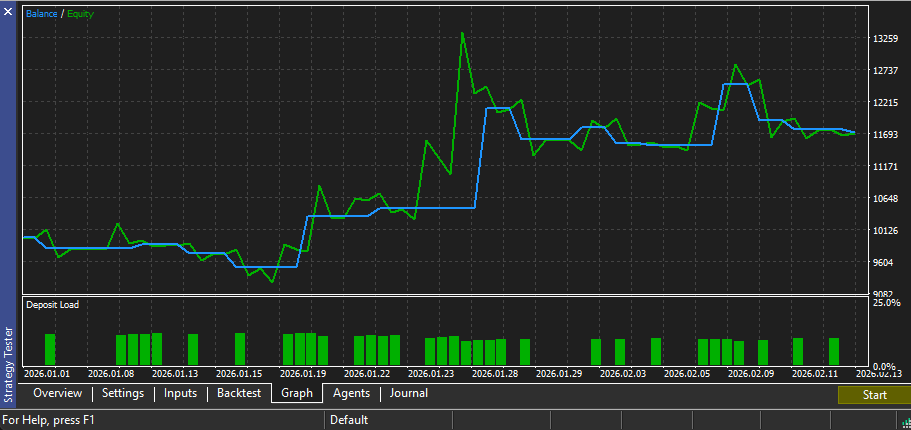
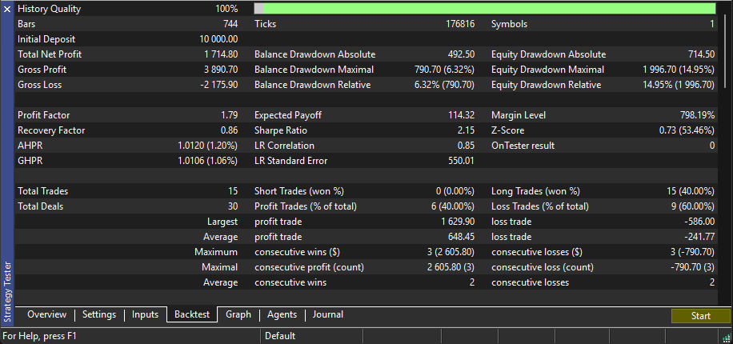
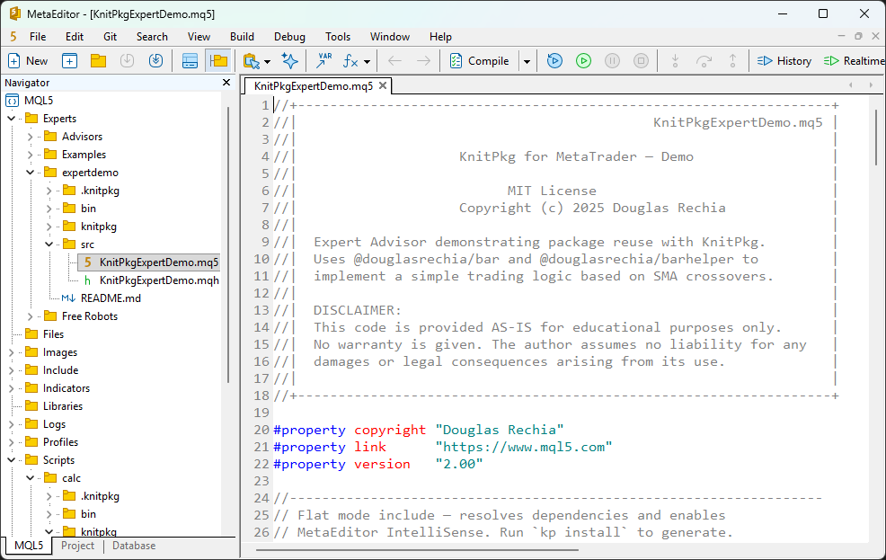
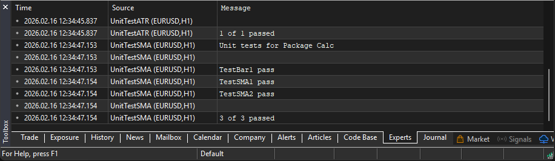

# Getting Started

This section provides a quick introduction to your first steps using KnitPkg. We assume you’ve already followed the [installation](installation.md) instructions and have a fresh MetaTrader installation at: `C:\Program Files\MetaTrader 5`

We’ll walk through:

- Installing a demo indicator in one step
- Installing a demo Expert Advisor in one step
- Downloading a package and running its unit tests

---

## Opening Windows Terminal in the MetaTrader Data Folder

Open MetaTrader and go to **File > Open Data Folder**. Then right-click inside the folder and select **Open in Terminal**:



You should now see the Terminal open in the MetaTrader Data folder:



---

## Installing the Demo Indicator in One Command

To download and compile the demo indicator `sma` directly into your MetaTrader environment, run:

```bash
kp get mql5 @douglasrechia/sma
```

After installation, the indicator won’t appear in MetaTrader until you refresh the Navigator. Right-click on **Indicators** and select **Refresh**:



You should now see the indicator at: Indicators/sma/bin/KnitPkgSMA

Double-click it to attach it to a chart. It will display a 10-period SMA by default.



!!! note
     By design, the KnitPkgSMA indicator updates only on new bars. It does not update on every tick, which significantly reduces CPU usage.

## Installing the Demo Expert Advisor and Running a Backtest

To download and compile the demo Expert Advisor `expertdemo`, run:

```bash
kp get mql5 @douglasrechia/expertdemo
```

Refresh the **Expert Advisors** section in the Navigator. You should now see:
Expert Advisors/expertdemo/bin/KnitPkgExpertDemo

!!! warning
     If you're using a real account, disable "Algo Trading" (Ctrl+E) to prevent accidental trades. This EA is for demonstration purposes only.

Instead of attaching the EA to a chart, let’s run a backtest:

1. Open **View > Strategy Tester**
2. In the Strategy Tester, select **Single**
3. In the **Settings** tab:
    - Choose Expert: `expertdemo/bin/KnitPkgExpertDemo.ex5`
    - Choose a symbol and timeframe (e.g., EURUSD H1)
    - Set **Modeling** to *1 minute OHLC* for faster execution

Example configuration:


Click **Start** and wait for the test to complete. Then check the **Graph** and **Backtest** tabs:





!!! note
     The `expertdemo` EA implements a simple moving average crossover strategy (long-only). The results shown reflect EURUSD performance from 2026-01-01 to 2026-02-13.

---

## Exploring a Package

KnitPkg encourages the use of reusable packages as building blocks for indicators, EAs, and other packages. Let’s explore the `@douglasrechia/calc` package, which powers both `KnitPkgSMA` and `KnitPkgExpertDemo`.

Download the package:

```bash
kp get mql5 @douglasrechia/calc
```

And explore it (and the others) with VSCode:

```bash
# Open the `calc` package
code .\MQL5\Scripts\calc\

# Open the `sma` indicator
code .\MQL5\Indicators\sma\

# Open `expertdemo` EA
code .\MQL5\Experts\expertdemo\
```

If you use **MetaEditor**, you can view only the MQL source files:



!!! note
     VSCode is recommended to visualize and edit others file types required to KnitPkg such as `yaml` and `json`.

Now go back to MetaTrader and refresh the **Scripts** section in the Navigator. You’ll see the test scripts under:
Scripts/calc/bin/

Run `UnitTestATR` and `UnitTestSMA` scripts (just double-click). Check the **Experts** tab in the Toolbox for test results:



---

Congratulations! You’ve successfully installed your first indicator, EA, and explored a reusable package using KnitPkg.

But this is just scratching the surface.

To truly understand how KnitPkg works and how to take full advantage of its capabilities, we encourage you to continue reading:

- The [Concepts](concepts/overview.md) section explains the core ideas and design principles behind KnitPkg.
- The [User Guide](user-guide/overview.md) provides detailed instructions on commands, workflows, and the full development lifecycle.

Dive deeper and unlock the full power of modular, testable, and maintainable MQL development with KnitPkg.