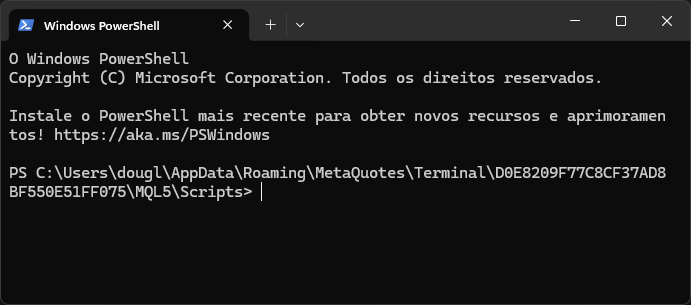
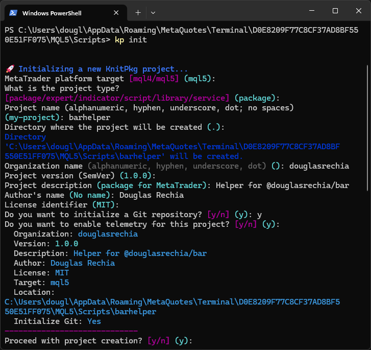
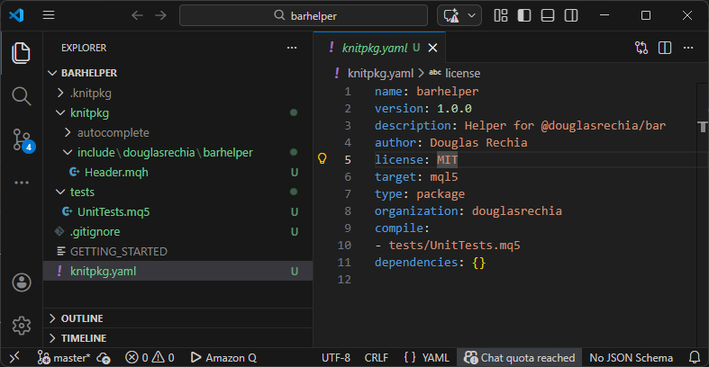
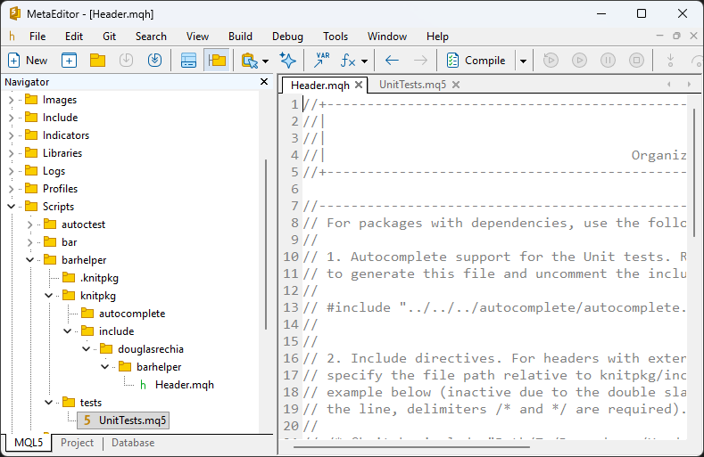

# Creating Packages

In this and following sections, we will create a new **composite package** called `barhelper`, which provides helper functions for the existing [`bar`](https://forge.mql5.io/DouglasRechia/bar) package. For example, we will implement a `Cross` function that returns `true` or `false` when two `TimeSeries` values cross.

---

## Step 1: Create a Git Repository

Before initializing the package, you must create a Git repository. We recommend starting with a **blank repository** (do not use templates). You can use any of the supported Git providers:

- [MQL5Forge](https://forge.mql5.io/repo/create) (requires [activating MQL5 Storage](https://www.metatrader5.com/en/metaeditor/help/mql5storage/mql5storage_connect))
- [GitHub](https://docs.github.com/en/repositories/creating-and-managing-repositories/creating-a-new-repository)
- [GitLab](https://docs.gitlab.com/user/project/)
- [Bitbucket](https://support.atlassian.com/bitbucket-cloud/docs/create-a-git-repository/)

Once created, your repository will have a Git URL like: https://forge.mql5.io/DouglasRechia/barhelper.git

From this URL, we extract two important values for the package manifest:

- `organization`: the Git namespace, lowercased (e.g., `douglasrechia`)
- `name`: the repository name (e.g., `barhelper`)

These values will be used in the `knitpkg.yaml` manifest:

```yaml
organization: douglasrechia
name: barhelper
```

!!! important "Organization naming"
    The organization part of the path is expected to match the Git repository owner/organization, normalized to lowercase.
    (Project names do not have to match the repository name, but organizations must.)

---

## Step 2: Initialize the Package

To create the package structure, we use the `kp init` command. First, open a terminal in the MetaTrader Scripts directory:

1. In MetaEditor, right-click on the `Scripts` folder in the Navigator panel.
2. Select **Open Folder**.
3. In Windows Explorer, right-click inside the folder and choose **Open in Terminal**.
4. Your terminal should now be in the `Scripts` directory, like this:



Now run the following command:

```bash
kp init
```

You will be prompted to answer a few questions. Use the appropriate values for `Project name` and `Organization name`. Keep the default values for the other fields unless you have specific needs.



After confirming with `y`, the project will be created.

---

## Step 3: Open the Project in VSCode

Navigate into the new project directory and open it in VSCode:

```bash
cd barhelper
code .
```

### Recommended Tools

- Use [MetaEditor](https://www.metatrader5.com/en/automated-trading/metaeditor) to edit `.mqh`, `.mq4`, and `.mq5` files. It offers excellent IntelliSense and follows MQL standards.
- Use [VSCode](https://code.visualstudio.com/) for editing other files like `.yaml` and for Git operations. You can enable MQL syntax highlighting in VSCode using [this tutorial](https://www.mql5.com/en/blogs/post/719548).

!!! tip
     You can also use the integrated terminal in VSCode by clicking **Terminal > New Terminal**.

Once opened, you will see the directory structure created by `kp init`:



---

## Step 4: Review the Manifest

The `knitpkg.yaml` file contains the metadata and configuration for your package:

```yaml title="barhelper manifest knitpkg.yaml"
name: barhelper
version: 1.0.0
description: Helper for @douglasrechia/bar
author: Douglas Rechia
license: MIT
target: mql5
type: package
organization: douglasrechia
compile:
- tests/UnitTests.mq5
dependencies: {}
```

!!! note
     A `GETTING_STARTED` file is also created to help beginners. You can delete it at any time — it is ignored by Git thanks to `.gitignore`.

---

## Step 5: Open the Project in MetaEditor

In MetaEditor, navigate to `Scripts/barhelper`. Only MQL files (`.mq5`, `.mqh`) are visible here, which is why we use VSCode as a complementary editor.



The `init` command also creates a header file at: knitpkg/include/douglasrechia/barhelper/Header.mqh

This file includes a commented-out directive for `autocomplete.mqh`. To enable IntelliSense later, simply uncomment that line. The file also contains a placeholder for the `@knitpkg:include` directive, which we will configure in the next steps.

---

## Next Step

We are now ready to add the `@douglasrechia/bar` dependency to `barhelper`. Continue to [Managing Dependencies](managing-dependencies.md).
