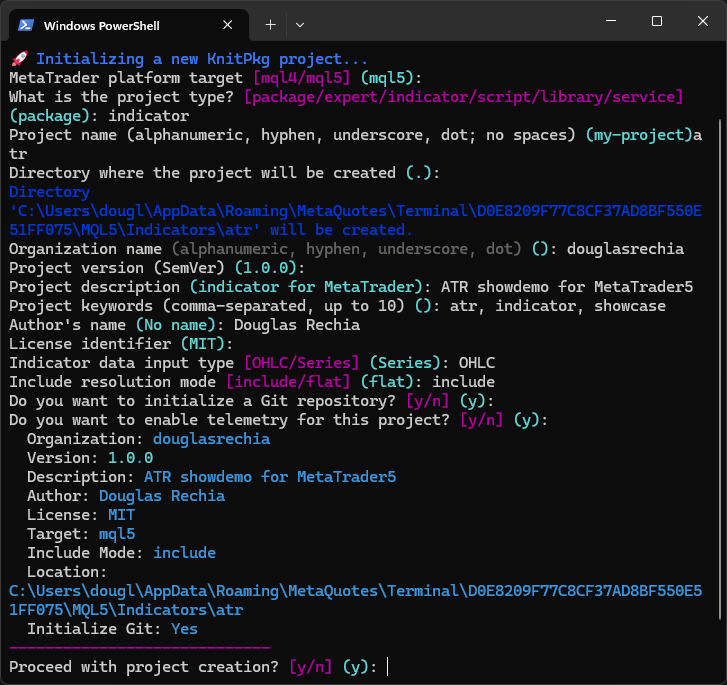
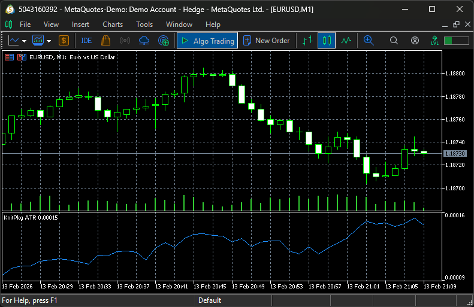

# Creating Projects

In this section, we will walk through the process of creating a new **project** using KnitPkg. While creating a project is very similar to creating a package, this guide provides a dedicated example to highlight the key differences and best practices.

---

## Example: Creating an ATR Indicator

We will create a new **indicator project** called `atr`, which implements the Average True Range (ATR) using the `ATR` function from the [`@douglasrechia/calc`](https://forge.mql5.io/DouglasRechia/calc) package. The resulting binary will be named `KnitPkgATR.ex5`.

---

## Step 1–4: Follow the Package Initialization Flow

You can follow the same initial steps described in [Creating Packages](creating-packages.md):

1. Create a new Git repository (e.g., [DouglasRechia/atr](https://forge.mql5.io/DouglasRechia/atr.git))
2. Open a terminal in your `MQL5/Indicators` directory
3. Run `kp init`
4. Choose `indicator` as the project type

Here’s an example of the terminal output during initialization:



!!! note
    While this example uses an indicator project, you could just as easily create an Expert Advisor or any other type of project to consume KnitPkg packages.

---

## Step 5: Add and Install Dependencies

We will use two packages:

- `@douglasrechia/bar` — for bar and time series utilities
- `@douglasrechia/calc` — for the ATR calculation

Run the following commands:

```bash
kp add @douglasrechia/bar
kp add @douglasrechia/calc
kp install
```

!!! note
    For packages, you use `kp autocomplete`. For projects (indicators, experts, etc.), use `kp install`.

After installation, your `dependencies` section in `knitpkg.yaml` should look like this:

```yaml
dependencies:
  '@douglasrechia/bar': ^1.1.0
  '@douglasrechia/calc': ^1.0.1
```

A `lock.json` file will also be created, locking the resolved versions.

---

## Step 6: Implement the Indicator

Now let’s use the `ATR` function from `calc` to implement the indicator logic.

You can find the complete source code here:

- [KnitPkgATR.mq5](resources/KnitPkgATR.mq5)

Once implemented, compile the indicator:

```bash
kp compile
```

Attach the compiled `KnitPkgATR.ex5` to a chart in MetaTrader to visualize the result:



---

## Step 7: Register the Project

Once the indicator is working and committed to Git, follow the instructions in [Registering a New Project](registry.md/#registering-a-new-project) to register it in the KnitPkg Registry.

To verify the registration:

```bash
kp info mql5 @douglasrechia/atr
```

---

Congratulations! You’ve created and registered a complete indicator project using KnitPkg packages. This demonstrates how easy it is to build modular, maintainable MQL5 projects with dependency management and version control.