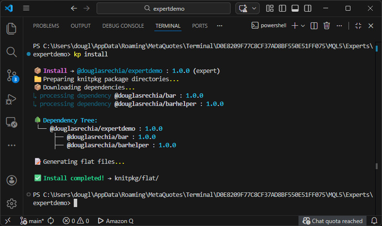
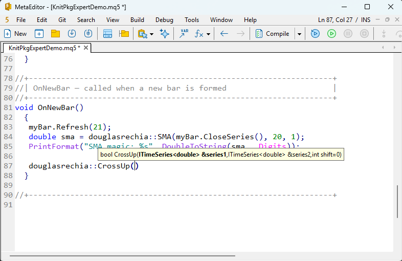
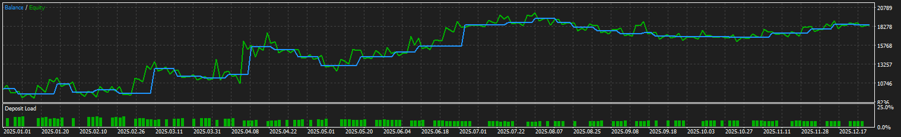

# Local Dependencies

During development, it is often useful to test a package in a real project before publishing it to the registry. In this section, we will demonstrate how to use **local dependencies** by integrating the `barhelper` package into the [`expertdemo`](https://forge.mql5.io/DouglasRechia/expertdemo/src/commit/fa5ea913177f0b01a66306c2be36743d6bc9f163) project.

We will implement a simple SMA-based trading strategy with the following logic:

- **Entry condition**: Enter long when `sma1` crosses above `sma2`.
- **Entry filter**: Only enter if `close > sma1 > sma2 > sma3`. This filter can be toggled on or off.
- **Exit condition**: Exit only when `sma1` crosses below `sma2`.
- **Parameter validation**: Ensure that `sma1.period < sma2.period < sma3.period`.

We will use the `CrossUp` function from `barhelper` before it is published to the registry, and we will retrieve SMA values using the `KnitPkgSMA` indicator. As a result, `expertdemo` will no longer depend on the `calc` package.

---

## Why Use Local Dependencies

Even with a complete suite of unit tests (and we know you always write them), you may want to validate your package in a real project before publishing. In other cases, you might want to integrate a package into a consumer project while still developing it. KnitPkg supports this workflow through **local dependencies**.

---

## Adding a Local Dependency

To add a local dependency, manually edit the `knitpkg.yaml` manifest and specify the path to the local package directory. You can use:

- A **relative path** (must start with `./` or `../` and use `/` as separator)
- A **file URI** (must start with `file://`, supports both `/` and `\`, and can be absolute or relative)

Here’s how to add `barhelper` as a local dependency to [`expertdemo`](https://forge.mql5.io/DouglasRechia/expertdemo/src/commit/fa5ea913177f0b01a66306c2be36743d6bc9f163):

```yaml linenums="26" hl_lines="3"
dependencies:
    '@douglasrechia/barhelper': ../../Scripts/barhelper
```

---

## Should You Declare an Indirect Dependency?

Since `barhelper` depends on `bar`, the `bar` package is available to `expertdemo` as an **indirect dependency**. But should we declare it explicitly?

Let’s consider:

- `barhelper` exposes a function (`CrossUp`) whose signature uses `ITimeSeries`, a type declared in `bar`. This is a dependency in the **API**, not just the implementation.
- If `barhelper` used `bar` only internally, and its API did not expose any symbols from `bar`, then `expertdemo` would not need to depend on `bar`.
- `expertdemo` also uses symbols from `bar` directly (e.g., `BarWatcher`, `BarMqlRates`), unrelated to `barhelper`.

From this, we conclude that an **indirect dependency** should be declared explicitly if:

- The API of a direct dependency uses symbols from the indirect dependency
- The consumer project uses symbols from the indirect dependency directly

Therefore, `expertdemo` should declare `bar` as a **direct dependency**. However, this also means that `expertdemo` becomes responsible for defining the version of `bar` to be used — either with a version range or an exact match.

In practice, this setup would work with or without declaring `bar`, but being explicit has its benefits.

---

## Adjusting Dependencies to Use the `sma` Indicator

Let’s add `bar` as a direct dependency:

```bash
kp add @douglasrechia/bar
```

We will use `CrossUp` to detect SMA crossovers. This function expects `ITimeSeries` inputs, which we will construct using the `KnitPkgSMA` indicator. This eliminates the need for the `calc` package.

Final dependency list in `expertdemo`:

```yaml
dependencies:
  '@douglasrechia/bar': ^1.0.0
  '@douglasrechia/barhelper': ../../Scripts/barhelper
```

---

## Updating the Entrypoint

The `expertdemo` project uses [Flat mode](https://forge.mql5.io/DouglasRechia/expertdemo/src/commit/fa5ea913177f0b01a66306c2be36743d6bc9f163/knitpkg.yaml), and its entrypoint is [`KnitPkgExpertDemo.mqh`](https://forge.mql5.io/DouglasRechia/expertdemo/src/commit/fa5ea913177f0b01a66306c2be36743d6bc9f163/src/KnitPkgExpertDemo.mqh).

Update the includes:

```mql5 linenums="28"
/* @knitpkg:include "douglasrechia/bar/BarWatcher.mqh" */
/* @knitpkg:include "douglasrechia/bar/BarMqlRates.mqh" */
/* @knitpkg:include "douglasrechia/bar/TimeSeriesArray.mqh" */
/* @knitpkg:include "douglasrechia/barhelper/Cross.mqh" */
```

---

## Installing Dependencies

Run:

```bash
kp install
```

You should see output like this:



`@douglasrechia/barhelper` appears in the dependency tree. Let’s confirm in MetaEditor:



The IntelliSense confirms that `CrossUp` is available via the generated flat file.

---

## Updating `expertdemo`

We’ll now implement the SMA strategy using `CrossUp`. Here’s the updated `OnNewBar()` function:

```mql5 linenums="114" hl_lines="8-11 26-28 31 41"
void OnNewBar()
  {
//--- Get latest 5 bars data
   myBar.Refresh(5);

//--- Get the 5 most recent values of SMA into the TimeSeries.
//--- Do it for the three SMAs.
   double sma1array[];
   ArraySetAsSeries(sma1array, true);
   CopyBuffer(sma1handle, 0, 0, 5, sma1array);
   douglasrechia::TimeSeriesArray<double> sma1(sma1array);

   double sma2array[];
   ArraySetAsSeries(sma2array, true);
   CopyBuffer(sma2handle, 0, 0, 5, sma2array);
   douglasrechia::TimeSeriesArray<double> sma2(sma2array);

   double sma3array[];
   ArraySetAsSeries(sma3array, true);
   CopyBuffer(sma3handle, 0, 0, 5, sma3array);
   douglasrechia::TimeSeriesArray<double> sma3(sma3array);

   if(!positionInfo.Select(_Symbol))
     {
      //--- No position. Check filter conditions.
      if(!filterEnabled || (myBar.Close(1) > sma1.ValueAtShift(1) &&
                            sma1.ValueAtShift(1) > sma2.ValueAtShift(1) &&
                            sma2.ValueAtShift(1) > sma3.ValueAtShift(1)))
        {
         //--- Open position if Short term sma1 crosses up Mid term sma2
         if(douglasrechia::CrossUp(sma1, sma2, 1))
           {
            Print(StringFormat("[%s] Let's do it", TimeToString(myBar.Time(0))));
            trade.Buy(1);
           }
        }
     }
   else
     {
      //--- Position is found. Close it if Short term sma1 crosses down Mid term sma2.
      if(douglasrechia::CrossUp(sma2, sma1, 1))
        {
         Print(StringFormat("[%s] Time to go", TimeToString(myBar.Time(0))));
         trade.PositionClose(_Symbol);
        }
     }

  }
```

You can find the full source here:

- [KnitPkgExpertDemo.mq5](resources/draft1/KnitPkgExpertDemo.mq5)
- [KnitPkgExpertDemo.mqh](resources/draft1/KnitPkgExpertDemo.mqh)

Here’s the equity curve for EURUSD H4 (2025-01-01 to 2025-12-31):



---

## Additional Improvements

Let’s improve the code by abstracting the SMA buffer-to-series logic into a helper function in `barhelper`.

We’ll create a new function `NewTimeSeriesFromIndicator()` in `barhelper`:

```mql5
TimeSeriesArray<double>* NewTimeSeriesFromIndicator(int indicatorHandler, int indicatorBufferNum, int startPos, int count)
  {
   double array[];
   ArraySetAsSeries(array, true);
   if(CopyBuffer(indicatorHandler, indicatorBufferNum, startPos, count, array) == -1)
      return NULL;

   return new TimeSeriesArray<double>(array);
  }
```

This function should be placed in
`knitpkg/include/douglasrechia/barhelper/IndicatorSeries.mqh`, which is available [here](resources/draft2/IndicatorSeries.mqh).

After updating `barhelper`, we can simplify `OnNewBar()` like this:

```mql5 linenums="119"
//--- Get the 5 most recent values of SMA into the TimeSeries.
//--- Do it for the three SMAs.
   douglasrechia::TimeSeriesArray<double>* sma1 =
      douglasrechia::NewTimeSeriesFromIndicator(sma1handle, 0, 0, 5);

   douglasrechia::TimeSeriesArray<double>* sma2 =
      douglasrechia::NewTimeSeriesFromIndicator(sma2handle, 0, 0, 5);

   douglasrechia::TimeSeriesArray<double>* sma3 =
      douglasrechia::NewTimeSeriesFromIndicator(sma3handle, 0, 0, 5);
```

This encapsulates the buffer-copy logic into a reusable abstraction. The final expert code is available here:

- [KnitPkgExpertDemo.mqh](resources/draft2/KnitPkgExpertDemo.mqh)
- [KnitPkgExpertDemo.mq5](resources/draft2/KnitPkgExpertDemo.mq5)

!!! note
    As you already know, `kp install` is required every time you update the entrypoint header with `@knitpkg:include`. Always run `kp checkinstall` to verify that the directives are correct.

---

Congratulations! You’ve learned how to use local dependencies, manage indirect dependencies, and improve code abstraction using KnitPkg.