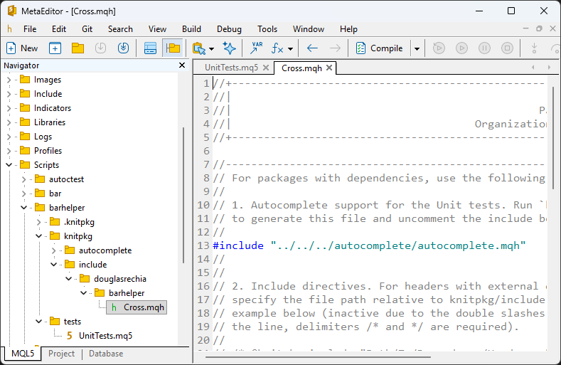
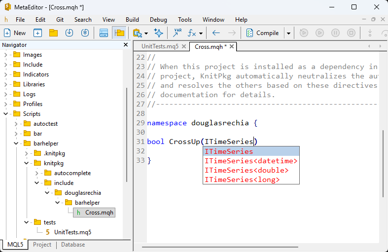
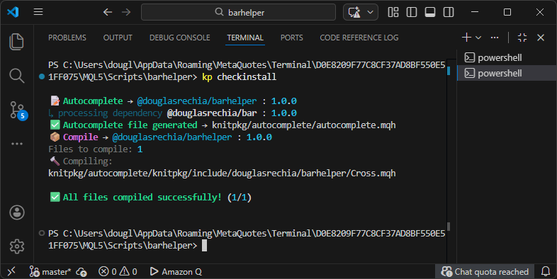

# Managing Dependencies

In the previous section, we created the `barhelper` package. Now we will add its dependency on `@douglasrechia/bar` using the `kp add` command:

```bash
kp add @douglasrechia/bar
```

After running the command, your `knitpkg.yaml` manifest will look like this:

```yaml title="Manifest dependencies after 'kp add'" linenums="11"
dependencies:
  '@douglasrechia/bar': ^1.0.0
```

The `kp add` command performs two actions:

- It queries the registry for the latest stable version of `@douglasrechia/bar`.
- It updates the manifest, adding the dependency with a default version specifier `^` pointing to the latest stable version.

If you want to specify a particular version or use a different version range, use the `--version` (or `-v`) option:

```bash
kp add @douglasrechia/bar --version 1.*.*
```

For more information on version specifiers, see [Version Ranges](../reference/version-ranges.md).

To remove a dependency, you can simply edit the manifest and delete the corresponding entry. You can also add dependencies manually by editing the manifest directly.

If you're unsure which version to use, you can inspect available versions with `kp info` as in the example below:

```bash
kp info mql5 @douglasrechia/bar
```

This command will display metadata and version history for the package. Try it yourself to explore the output.

---

## Autocomplete

Now that the dependency is added, let’s generate the `autocomplete.mqh` file to enable IntelliSense support:

```bash
kp autocomplete
```

This will create the file `knitpkg/autocomplete/autocomplete.mqh`. Open `knitpkg/include/douglasrechia/barhelper/Header.mqh`, uncomment the line that includes `autocomplete.mqh`, and rename the file to `Cross.mqh`.

After these changes, your MetaEditor should look like this:



Now you can implement the `CrossUp` function inside the `douglasrechia` namespace. Since `autocomplete.mqh` includes all headers from dependencies, IntelliSense will work seamlessly:



!!! note
    As explained in [Projects vs Packages](../concepts/projects-vs-packages.md), it is recommended to place your code inside a namespace matching the organization name when targeting MQL5. This helps avoid symbol conflicts.

---

## Adding the `@knitpkg:include` Directive

At this point, your code might look like this:

```mql5 linenums="29"
namespace douglasrechia
{

bool CrossUp(ITimeSeries<double> &series1, ITimeSeries<double> &series2, int shift=0)
  {
// Return false if shift is negative or out of bounds
   if(shift < 0)
      return false;
   if(shift >= series1.Size()-1)
      return false;
   if(shift >= series2.Size()-1)
      return false;

   return series1.ValueAtShift(shift+1) < series2.ValueAtShift(shift+1) &&
          series1.ValueAtShift(shift) > series2.ValueAtShift(shift);
  }

}
```

To ensure the header `knitpkg/include/douglasrechia/barhelper/Cross.mqh` compiles correctly when the package is installed as a dependency, you must add the following directive (without `//`):

```mql5 linenums="21"
/* @knitpkg:include "douglasrechia/bar/TimeSeries.mqh" */
```

This directive tells KnitPkg to resolve the reference to `ITimeSeries` from the `bar` package.

### Tip: Navigating with IntelliSense

Place your cursor over `ITimeSeries` in the `CrossUp` function and press `Alt+G`. MetaEditor will open the resolved definition from:
`knitpkg/autocomplete/knitpkg/include/douglasrechia/bar/TimeSeries.mqh`.

This demonstrates how `autocomplete.mqh` works: it assembles all headers from dependencies into a local structure with resolved includes. By navigating to the symbol, you can identify the exact header to reference in your `@knitpkg:include` directive. Always use paths relative to `knitpkg/include`.

---

## Final Header: `Cross.mqh`

Here is the complete `Cross.mqh` file after removing placeholder comments and enabling autocomplete:

```mql5 linenums="1"
//+------------------------------------------------------------------+
//|                                                       Header.mqh |
//|                                                Package barhelper |
//|                                      Organization: douglasrechia |
//+------------------------------------------------------------------+

#include "../../../autocomplete/autocomplete.mqh"

/* @knitpkg:include "douglasrechia/bar/TimeSeries.mqh" */

namespace douglasrechia
{

bool CrossUp(ITimeSeries<double> &series1, ITimeSeries<double> &series2, int shift=0)
  {
// Return false if shift is negative or out of bounds
   if(shift < 0)
      return false;
   if(shift >= series1.Size()-1)
      return false;
   if(shift >= series2.Size()-1)
      return false;

   return series1.ValueAtShift(shift+1) < series2.ValueAtShift(shift+1) &&
          series1.ValueAtShift(shift) > series2.ValueAtShift(shift);
  }

}
//+------------------------------------------------------------------+

```

---

## Validating the Directive

Is the `@knitpkg:include` directive correct? You can try compiling the header in MetaEditor (press `F7` or use the **Build > Compile** menu). The compiler will say everything is OK — but remember, the directive is inside a `/* */` comment block, so the MQL compiler ignores it.

To validate the directive with KnitPkg, use the following command:

```bash
kp checkinstall
```

You should see output like this:



KnitPkg confirms that the `Cross.mqh` header will compile when `barhelper` is installed!

As an exercise, try introducing an error in the path of the `@knitpkg:include` directive and run `kp checkinstall` again to see how KnitPkg reports the issue.


!!! note "Dependencies Between Headers in the Same Package"

    When one header in your package depends on another header from the same package, you do **not** need to use the `@knitpkg:include` directive. Instead, use a standard `#include` directive with a relative path.

    For example: suppose that `Cross.mqh` depends on `Utils.mqh` within the same package, you can write:

    ```mql5
    #include "Utils.mqh"
    ```

    This is a local include and will work as expected during both development and when the package is installed. For more details, see the section [Dependencies between headers inside the same package](../concepts/composite-packages.md/#dependencies-between-headers-inside-the-same-package).

!!! note "Working with Single Packages"

    The process for creating **single packages** is essentially the same as for composite packages. However, there are two key differences:

    - You do **not** need to run `kp autocomplete`, since single packages do not have any external dependencies and thus the headers compile cleanly as a normal `.mqh` files.
    - You do **not** need to run `kp checkinstall`, because the exported headers will not have the `@knitpkg:include` directives.

    This makes the workflow for single packages simpler and more lightweight.

---

Congratulations! You now know how to manage dependencies and create compilable headers using MetaEditor and KnitPkg. Well done!
