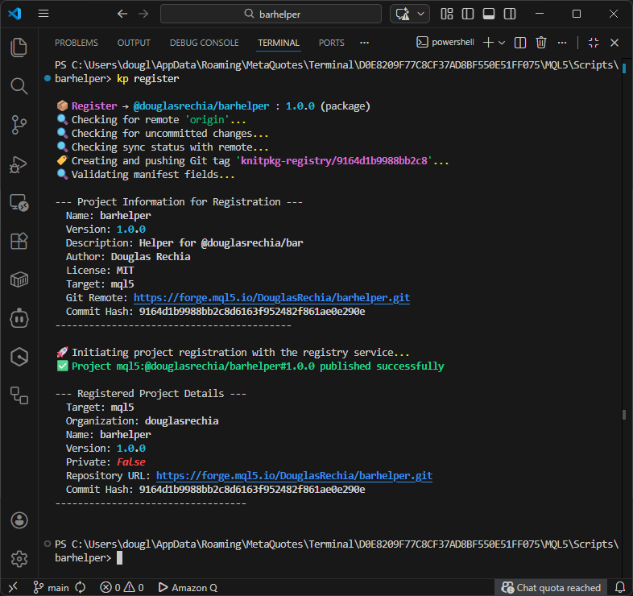
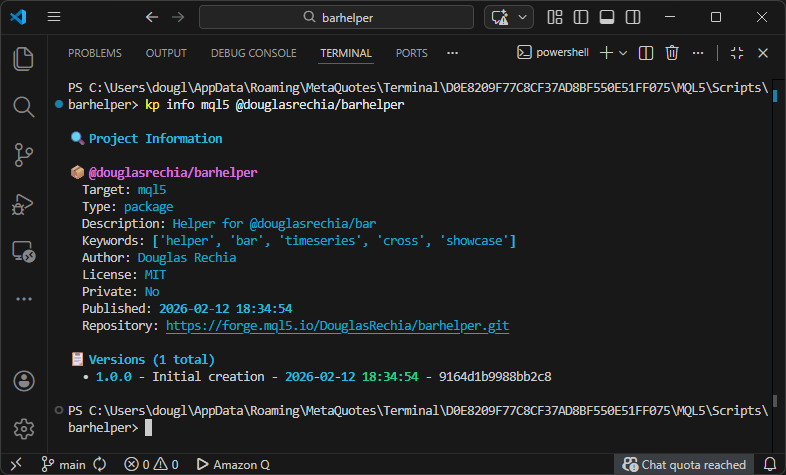

# Registry

In this section, we will demonstrate how to register a new package to the KnitPkg Registry using the `barhelper` project created earlier. See [Registry](../concepts/registry.md) to check out what the registry is.

---

## Registering a New Project

To register a project to the registry, follow these steps:

1. **Prepare the project for registration**:

    - Ensure the `knitpkg.yaml` manifest is complete and up to date.
    - For packages, run `kp checkinstall` to validate all `@knitpkg:include` directives.
    - Add a short description of the current version in the [`version_description`](../reference/manifest.md/#version_description-optional) field. For new projects, use something like `"Initial creation"`.
    - Make sure your manifest includes metadata that improves discoverability (see next section).

2. **Commit and push to a public Git repository**:
    
    - Your repository must be public to be registered in the Free tier.

3. **Run `kp register`** to register the project.

---

## Improving Discoverability in the Registry

To make your project easier to find via [`kp search`](../reference/cli.md/#kp-search), configure the following fields in your `knitpkg.yaml`:

- [`description`](../reference/manifest.md/#description-required): A short summary of what your project does.
- [`keywords`](../reference/manifest.md/#keywords-optional): Add relevant tags to improve searchability.

---

## How Registry Search Works

The KnitPkg Registry supports flexible search capabilities via [`kp search`](../reference/cli.md/#kp-search):

- **Generic search**: `--query` searches across `name`, `keywords`, and `description` (in that order).
- **Filters**: Use `--organization`, `--type`, `--author`, or `--license` to narrow results.
- **Sorting**: Use `--sort-by` and `--sort-order` to control result order.
- **Pagination**: Use `--page` and `--page-size` to control result size and navigation.

---

## Example: Registering `barhelper`

First, check the Git status:

```bash
git status
```

Expected output:

```
On branch master

No commits yet

Untracked files:
  (use "git add <file>..." to include in what will be committed)
        .gitignore
        LICENSE
        README.md
        knitpkg.yaml
        knitpkg/
        tests/

nothing added to commit but untracked files present (use "git add" to track)
```

If you didn’t initialize Git during `kp init`, run `git init` first.

Now stage and commit the files:

```bash
git add .
git commit -m 'Initial creation'
```

Switch to the default branch (`main` for example) and push to the remote:

```bash
git switch -c main
git remote add origin https://forge.mql5.io/DouglasRechia/barhelper.git
git push -u origin main
```

Ensure the repository is public. Private repositories are not supported in the Free tier.

---

## Logging in to the Registry

Before registering, log in using your Git provider credentials with [`kp login`](../reference/cli.md/#kp-login):

```bash
kp login --provider mql5forge
```

This opens a browser window for secure OAuth authentication.

To check your current session:

```bash
kp whoami
```

Example output:

```
👤 User Information

  ID: 3
  Username: ---------
  Provider: mql5forge
  Email: -----@--------
  Subscription Tier: FREE
```

---

## Registering the Project

Run:

```bash
kp register
```

You should see output like this:



KnitPkg will verify:

- The repository is public
- You have push access to the repository

Only users with write access can register a project.

!!! note
    By registering a project, you agree to the [Terms of Service](../terms-of-service/registry.md).

To confirm the project was registered:

```bash
kp info mql5 @douglasrechia/barhelper
```



---

## Searching the Registry

To search for projects:

```bash
kp search mql5 -q SMA
```

Try different queries and filters. See more options in the [`kp search` CLI reference](../reference/cli.md/#kp-search).

To inspect project versions:

```bash
kp info mql5 @douglasrechia/barhelper
```

---

## Yank a Version

If you discover a critical issue in a released version, you can [**yank**](../concepts/registry.md/#version-yanking) it:

```bash
kp yank mql5 @douglasrechia/barhelper 1.0.0
```

Yanked versions:

- Are not resolved by [version ranges](../reference/version-ranges.md/#yanked-versions)
- Can still be resolved via exact match or with `--locked`

---

## Other Useful Registry Commands

- [`kp logout`](../reference/cli.md/#kp-logout): Logs out from the registry
- [`kp status`](../reference/cli.md/#kp-status): Show registry status and configuration along with supported Git providers
- [`kp get`](../reference/cli.md/#kp-get): Download and build a project in one step

See the [CLI reference](../reference/cli.md) and [Registry concepts](../concepts/registry.md) for more details.