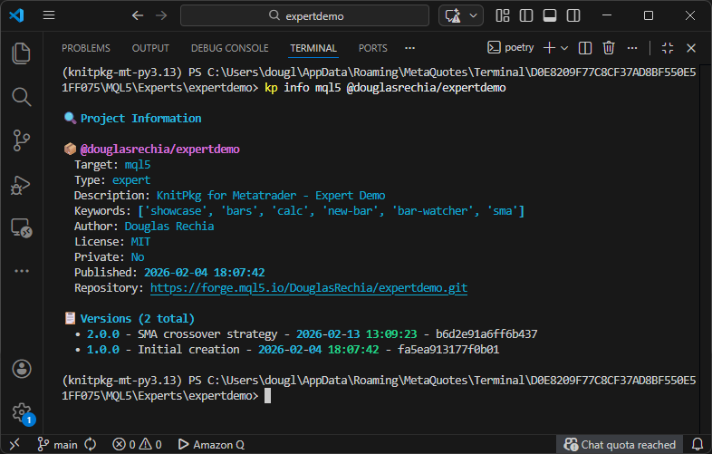

# Revisions

In this section, we will cover how to create a new revision for a project. Revisions are essential for tracking changes, ensuring reproducibility, and communicating improvements to users.

In the previous sections, we created and registered the [`barhelper`](https://forge.mql5.io/DouglasRechia/barhelper/src/commit/9164d1b9988bb2c8d6163f952482f861ae0e290e) package and implemented a moving average crossover strategy in `expertdemo`. Now it’s time to register a new version of the Expert.

---

## Creating a New Revision

The `expertdemo` project has changed significantly. It went from simple logging to implementing a real trading strategy (see [here](local-dependencies.md/#updating-expertdemo)). The current version is [`1.0.0`](https://forge.mql5.io/DouglasRechia/expertdemo/src/commit/fa5ea913177f0b01a66306c2be36743d6bc9f163). Given the scope of the change, we will bump the version to `2.0.0`, following [Semantic Versioning](https://semver.org/).

!!! tip
    Before pushing your changes, use VSCode’s Source Control panel (Ctrl+Shift+G) or `git diff` to review your modifications.

---

## Versioning Rules

Once a version is released, it **must not be modified**. Any change must be released as a **new version**.

When registering a new version `register_v`, KnitPkg enforces the following rules:

1. **No reuse of version numbers**  
    - If `register_v` already exists, registration is rejected.

2. **No backwards publishing within a release line**  
    - If the same **major** version exists, `register_v` must be greater than the highest version in that major.
    - If the same **major.minor** exists, `register_v` must be greater than the highest version in that line.

3. **Major version jumps are limited**  
    - You may only bump the major version by **+1** relative to the current highest overall major.
    - Example: if the highest version is `2.4.0`, then `3.0.0` is allowed, but `4.0.0` is rejected.

4. **No new major lines below the current highest**  
    - You cannot introduce a new major version lower than the current highest overall version.

5. **SemVer immutability**  
    - Once a version is released, it must not be modified. Any change must be released as a new version.

---

## Revision Checklist

Before registering a new version, follow this checklist:

1. Review your changes using VSCode or `git diff`.
2. Replace any local dependency paths in `knitpkg.yaml` with version ranges from the registry.
3. Test your changes thoroughly. Run unit tests. For packages, run `kp checkinstall`.
4. Update the version number in `knitpkg.yaml`.
5. Add or update the `version_description` field.
6. (Optional) Update `description`, `keywords`, `author`, or `license` if needed.
7. Commit and push your changes.
8. Run `kp register`.

Skipping steps may lead to bugs or inconsistencies. Trust the process. 😉

---

## Example: `expertdemo` 2.0.0

After completing the checklist, commit and push your changes:

```bash
git add .
git commit -m "feat: implement crossing moving average strategy"
git push
```

Now register the new version:

```bash
kp register
```

Verify with:

```bash
kp info mql5 @douglasrechia/expertdemo
```



---

## New Revisions for `bar`, `barhelper`, and `calc`

While writing the [Unit Tests](../concepts/unit-tests.md) section, we noticed several improvements:

- Unit tests in `bar` and `calc` are in the wrong directory (`src/` instead of `tests/`)
- Their READMEs need updates
- The `ATR` function in `calc` is incorrect and lacks tests
- `barhelper`'s `NewTimeSeriesFromIndicator` can be optimized to avoid unnecessary array copies

### Planned Revisions

- **`calc`**: Bug fix in `ATR`, test relocation, README update  
  → Bump from `1.0.0` to `1.0.1`

- **`bar`**: Add new constructor and interface `ITimeSeriesArraySetup`  
  → Bump from `1.0.0` to `1.1.0`

- **`barhelper`**: Internal optimization of `NewTimeSeriesFromIndicator`  
  → Bump from `1.0.0` to `1.0.1`

You already know how to perform these updates. Just follow the same checklist and versioning rules.

---

## Updating `expertdemo` Dependencies

After releasing new versions of `bar`, `barhelper`, and `calc`, we want `expertdemo` to benefit from the improvements.

Current `knitpkg.yaml`:

```yaml linenums="26"
dependencies:
  '@douglasrechia/bar': ^1.0.0
  '@douglasrechia/barhelper': ^1.0.0
```

Current [lock.json](https://forge.mql5.io/DouglasRechia/expertdemo/src/commit/b6d2e91a6ff6b437f10b3055589188d7b2bef907/knitpkg/lock.json) resolves both to `1.0.0`.

Because we’re using version ranges (`^1.0.0`), we don’t need to change the manifest. Just run:

```bash
kp install
```

This will update the lockfile to:

- `@douglasrechia/bar` → `1.1.0`
- `@douglasrechia/barhelper` → `1.0.1`

Since the lockfile changed, we recommend releasing `expertdemo` version `2.0.1`. This ensures that anyone installing `2.0.1` with `--locked` will get the exact same build and benefit from the performance improvements.

---

Congratulations! You now know how to evolve your projects and packages using Semantic Versioning and KnitPkg’s revision system.