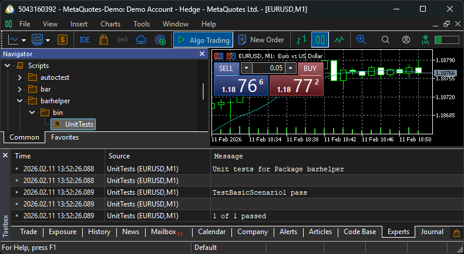

# Unit Tests

In this section, we will write a unit test for the `CrossUp` function implemented in the `barhelper` package. The `kp init` command already created a test skeleton in `tests/UnitTests.mq5`, which we will now complete. See [Unit Tests](../concepts/unit-tests.md) section for a more conceptual view on this topic.

---

## Step 1: Review the Generated Skeleton

Open the file `tests/UnitTests.mq5`. You will see a basic structure like this:

```mql5 title="Fragment of tests/UnitTests generated by init command" linenums="1" hl_lines="6 7 20"
//+------------------------------------------------------------------+
//|                                                    UnitTests.mq5 |
//|                                 Unit Tests for Package barhelper |
//|                                      Organization: douglasrechia |
//+------------------------------------------------------------------+
#property copyright   "<Add copyright here>"
#property link        "<Add link here>"
#property description ""
#property description "Version: 1.0.0"
#property description ""
#property description "Description: Unit tests for package barhelper"
#property description "Organization: douglasrechia"
#property description "Author: Douglas Rechia"
#property description "License: MIT"
#property description ""
#property description "Powered by KnitPkg for MetaTrader"
#property description "https://knitpkg.dev"

// Include the headers under test
#include "../knitpkg/include/douglasrechia/barhelper/Header.mqh"

//+------------------------------------------------------------------+
//|                                                                  |
//+------------------------------------------------------------------+
bool TestName()
  {
```

Note that line 20 includes the old header name `Header.mqh`. Since we renamed it to `Cross.mqh`, we need to update the include path accordingly.

---

## Step 2: Implement the Unit Test

We will rename the placeholder function `TestName` to `TestBasicScenario1` and implement a basic test case for `CrossUp`. After editing, the file should look like this:

```mql5 title="Unit Test for barhelper" linenums="1"
//+------------------------------------------------------------------+
//|                                                    UnitTests.mq5 |
//|                                 Unit Tests for Package barhelper |
//|                                      Organization: douglasrechia |
//+------------------------------------------------------------------+
#property copyright   "Douglas Rechia"
#property link        "https://knitpkg.dev"
#property description ""
#property description "Version: 1.0.0"
#property description ""
#property description "Description: Unit tests for package barhelper"
#property description "Organization: douglasrechia"
#property description "Author: Douglas Rechia"
#property description "License: MIT"
#property description ""
#property description "Powered by KnitPkg for MetaTrader"
#property description "https://knitpkg.dev"

// Include the headers under test
#include "../knitpkg/include/douglasrechia/barhelper/Cross.mqh"

//+------------------------------------------------------------------+
//|                                                                  |
//+------------------------------------------------------------------+
bool TestBasicScenario1()
  {
   double array2[] = {0.99,   0.98,    1.00,    1.00,    1.03,    1.04,    1.02};
   double array1[] = {1.00,   1.01,    1.01,    1.01,    1.02,    1.01,    1.03};
   bool expected[] = {false,  false,   false,   false,   false,   false,   true};

   douglasrechia::TimeSeriesArray<double> series1(array1, -1, -1, false);
   douglasrechia::TimeSeriesArray<double> series2(array2, -1, -1, false);

   for(int i=5;i>=0;i--)
     {
      // expected index is in the inverse order because TimeSeries index 0 is the latest element
      if(douglasrechia::CrossUp(series1, series2, i) != expected[ArraySize(expected)-i-1])
        {
         Print(StringFormat("Fail at shift %d", i));
         return false;
        }
     }

   return true;
  }

//+------------------------------------------------------------------+
//| DoTests                                                          |
//+------------------------------------------------------------------+
void DoTests(int &testsPerformed,int &testsPassed)
  {
   string testName="";

//--- TestBasicScenario1
   testsPerformed++;
   testName="TestBasicScenario1";
   if(TestBasicScenario1())
     {
      testsPassed++;
      PrintFormat("%s pass",testName);
     }
   else
      PrintFormat("%s failed",testName);
//---
// Add more tests here as needed
  }
//+------------------------------------------------------------------+
//| UnitTests()                                                      |
//+------------------------------------------------------------------+
void UnitTests(const string packageName)
  {
   PrintFormat("Unit tests for Package %s\n",packageName);
//--- initial values
   int testsPerformed=0;
   int testsPassed=0;
//--- test distributions
   DoTests(testsPerformed,testsPassed);
//--- print statistics
   PrintFormat("\n%d of %d passed",testsPassed,testsPerformed);
  }
//+------------------------------------------------------------------+
//| Script program start function                                    |
//+------------------------------------------------------------------+
void OnStart()
  {
   UnitTests("barhelper");
  }
//+------------------------------------------------------------------+
```

---

## Step 3: Compile and Run the Tests

You can compile the test using either:

```bash
kp compile
```

Or by pressing `F7` in MetaEditor.

To run the test:

- If compiled via `kp compile`, execute `Scripts/barhelper/bin/UnitTests` in MetaTrader.
- If compiled via MetaEditor, execute `Scripts/barhelper/tests/UnitTests`.

Check the **Experts** tab for output like this:



---

## Suggested Exercises

- Implement a `Cross` function that returns `true` if either series crosses the other.
- Add a test for `CrossUp(series2, series1)` to verify the inverse case.
- Add a test for `Cross(series1, series2)` to validate the new function.
- Add a test for out-of-bounds `shift` values to ensure your function handles edge cases safely.

!!! note "Adding New Unit Tests"
    Every time you create a new unit test function, you must also add a call to it inside the `DoTests(...)` function. This ensures that the test is executed when the script runs. For more details, see the section [Test skeleton generated by kp init](../concepts/unit-tests.md/#test-skeleton-generated-by-kp-init).
---

Congratulations! You now know how to write unit tests for your KnitPkg packages. This will make your code more robust, maintainable, and easier to evolve with confidence.